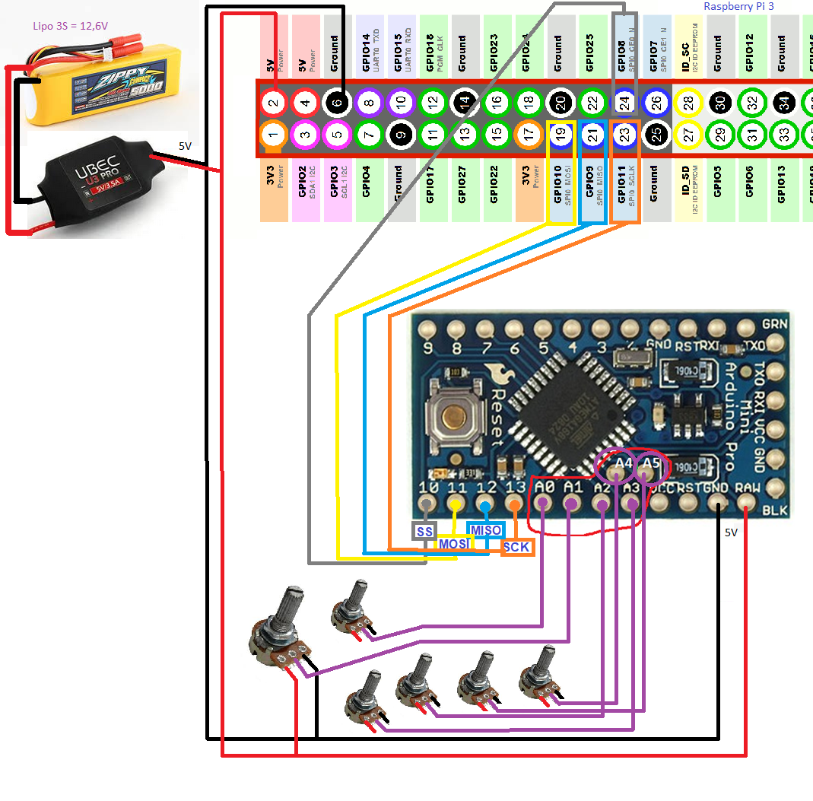

# spi_slave
Sur "arduino pro mini" il y a 6 entrées analogiques A0 à A5.

Le protocole I2C utilise 2 des entrées analogiques : A4 et A5.

On ne peut donc utiliser, au travers de I2C, que 4 entrées analogiques A0, A1, A2 et A3

Pour disposer des 6 entrées analogiques, la solution est d'utiliser l'autre bus disponible : SPI.

